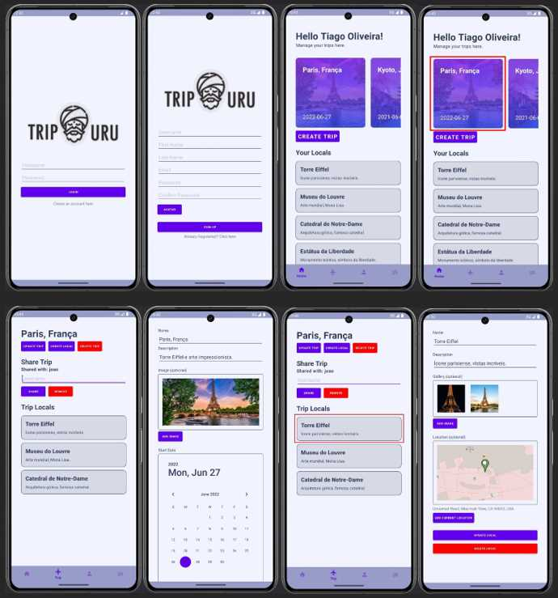

# Travel Management App 

This project consists of an Android client and a Django RestAPI backend. While significant progress was made, the project was not complete.

## API Setup

### Prerequisites

- Python 3.x
- PostgreSQL
- Git

### Clone the repository

- git clone [git@github.com:tiagooliveiragithub/kotlin-django-travel-manager.git](git@github.com:tiagooliveiragithub/kotlin-django-travel-manager.git)
- cd kotlin-django-travel-manager

### Set up virtual environment
   
- python3 -m venv venv
- ./venv/scripts/activate (On Windows)
- pip install -r requirements.txt

### Set up PostgreSQL database

- Ensure PostgreSQL is installed and running.
- Create a new PostgreSQL database named travelapi.

### Configure the database settings in settings.py of Django project

python

    DATABASES = {
        'default': {
            'ENGINE': 'django.db.backends.postgresql',
            'NAME': 'travelapi',
            'USER': 'postgres',
            'PASSWORD': 'your_password',  # Replace with your actual user password
            'HOST': 'localhost',
            'PORT': '5432',
        }
    }

### Apply database migrations and run server

- python project/manage.py makemigrations
- python project/manage.py migrate
- python project/manage.py runserver

### Android App Setup

- Open the app project in Android Studio and build and run the application with the Android Emulator. In the folder dependecyinjection, has a class AppModule, change the ip address from the online api to your local api.
